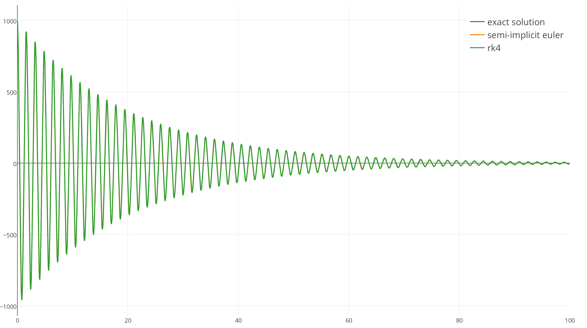
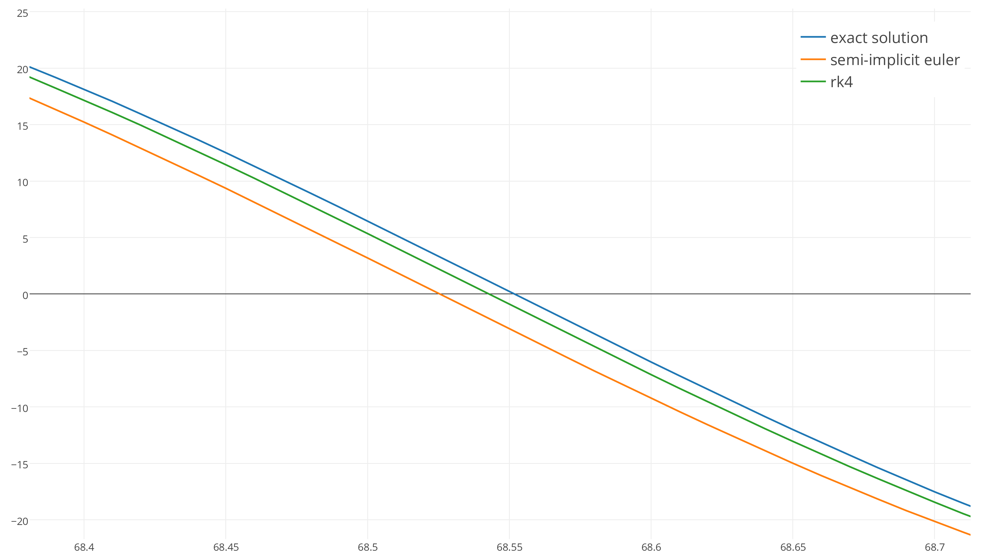
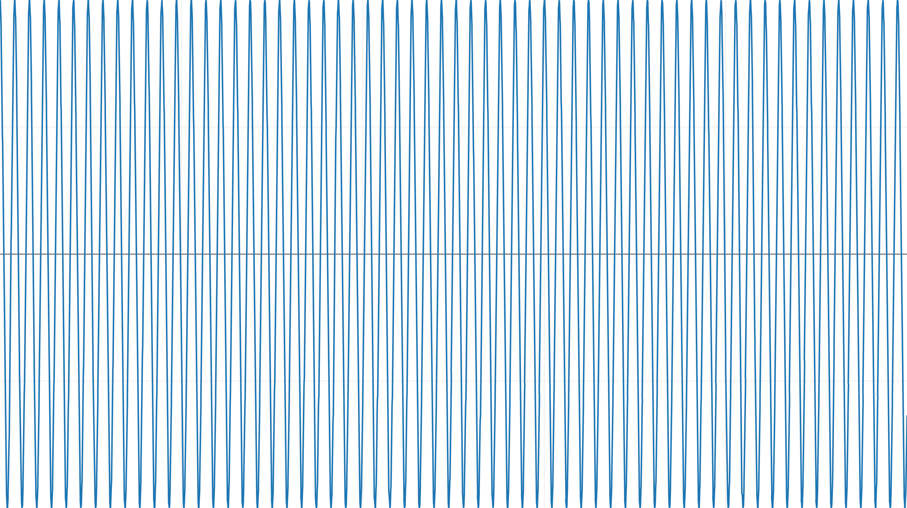
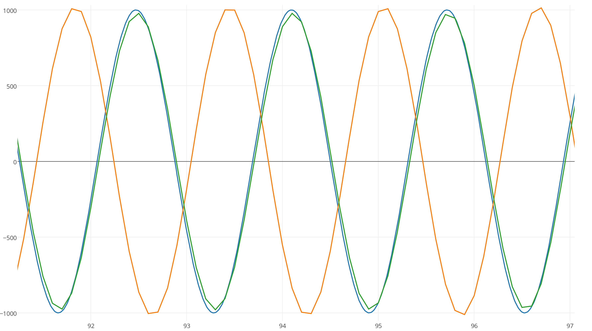
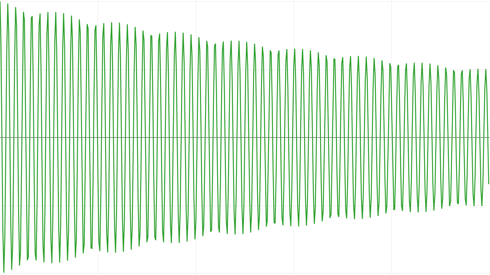
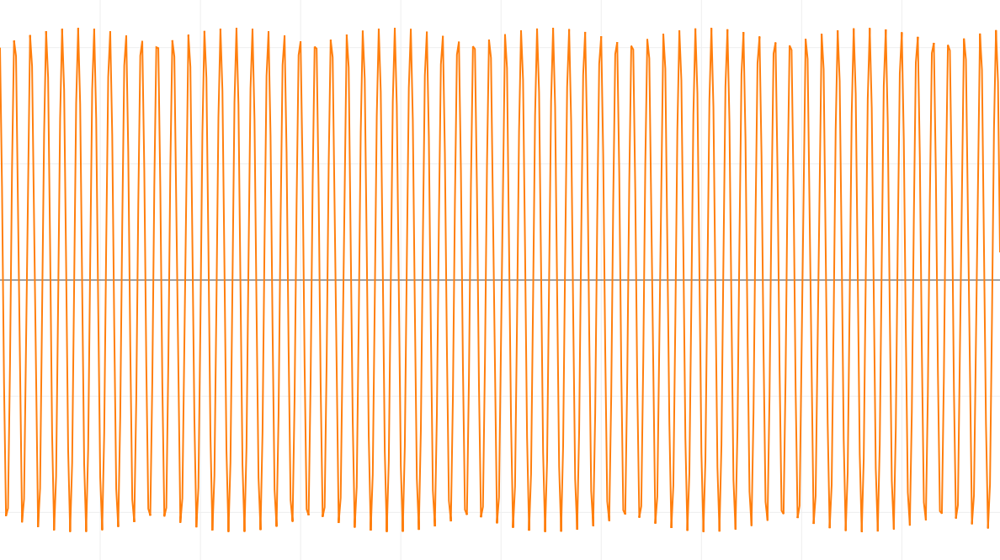

# 翻译|游戏物理基础|Gaffer On Games - Integration Basics

> 原文地址：[Integration Basics](https://gafferongames.com/post/integration_basics/)

## Introduction
你好，我是Glenn Fiedler，欢迎来到游戏物理的世界

如果你曾经想了解物理模拟是如何在计算机游戏里工作的，那么本系列文章将为你解释它。我认为读者已经熟练掌握C++，对物理和数学也有一定的基础。如果你注意并研究示例源代码，就不再需要其他任何预备知识。

物理模拟的工作原理是根据物理定律做出许多小的预测。这些预测事实上非常的简单，可以直接总结为“这个物体在这里，正在非常快速地向那个方向移动，所以在一个很小的时间段后，这个物体应该出现在那里”。我们使用一个称为积分（Intergration）的数学工具来执行这些预测。

本文章的主题是如何正确地地实现这个数学积分。

## Integrating the Equations of Motion
你可能仍记得在高中或大学的物理课上学到过，力等于质量乘以加速度  
> $F = m * a$  
  
我们可以将式子转换为加速度除以质量。这更直观，因为较重的物体更难投掷。
> $a = F/m$ 

加速度是速度随时间的变化率：
> $dv/dt = a = F/m$

同样地，速度也是位置随时间的变化率
> $dx/dt = v$ 

这意味着，如果我们知道一个物体当前的位置和速度，以及施加到它身上的力，我们可以在未来的某个时刻进行积分，以找到物体那时刻的位置和速度。

## Numerical Integration
对于那些没有在大学里正式学过微分方程的人来说，振作起来，因为你所处的位置几乎和那些学过微分方程的人一样好。这是因为我们不会像在一年级数学中那样解析求解微分方程。相反，我们将进行数值积分来找到解决方案。

数值积分就是这么运作的。首先，给定一个初始的位置和速度，然后在时间轴上向前迈出一小步，找到未来该时刻上的位置和速度。然后重复这一步骤，以小的时间步长向前移动，将上一次计算的结果作为下一次的初始条件。

但是我们如何找到每一步的速度和位置的变化呢？

答案就是运动学方程。

让我们把当前时间称为$t$，时间步长称为$dt$或“delta时间”

我们现在可以用一种所有人都能理解的形式展现运动学方程：  
>$acceleration = force/mass$    
>$change in position = velocity * dt$   
>$change in velocity = acceleration * dt$   

这是非常直观的，因为如果你坐在一辆时速60公里每小时的汽车里，一小时后你就会行驶60公里。同样地，一辆每秒加速度为10公里的汽车在10秒后将以每小时100公里的速度行驶。

当然，上述的逻辑仅在加速度和速度为常量时才成立。但即使它们不是，这仍然是一个相当不错的近似估计。

让我们用代码实现这些逻辑。将一个重1公斤的静止物体放置在原点开始，对物体施加10牛顿的恒定力，并以1秒的时间步长向前推进：
```
double t = 0.0;
    float dt = 1.0f;

    float velocity = 0.0f;
    float position = 0.0f;
    float force = 10.0f;
    float mass = 1.0f;

    while ( t <= 10.0 )
    {
        position = position + velocity * dt;
        velocity = velocity + ( force / mass ) * dt;
        t += dt;
    }
```
输出的结果如下：
```
    t=0:    position = 0      velocity = 0
    t=1:    position = 0      velocity = 10
    t=2:    position = 10     velocity = 20
    t=3:    position = 30     velocity = 30
    t=4:    position = 60     velocity = 40
    t=5:    position = 100    velocity = 50
    t=6:    position = 150    velocity = 60
    t=7:    position = 210    velocity = 70
    t=8:    position = 280    velocity = 80
    t=9:    position = 360    velocity = 90
    t=10:   position = 450    velocity = 100
```
正如你所看到的，在每一个步长我们都知道物体的位置和速度。这就是数值积分

## Explicit Euler
我们刚刚所使用的是一种称为显式欧拉的积分。

为了避免您将来的尴尬，我现在必须指出，Euler 的发音为“Oiler”而不是“yew-ler”，因为它是第一个发现该技术的瑞士数学家 Leonhard Euler 的姓氏。

欧拉积分是最基本的数值积分技术。当变化率在时间步长内保持恒定时，它才 100% 准确。

由于上面的例子中加速度是恒定的，因此速度的积分没有误差。 然而，我们也通过对速度来积分获得位置，而速度由于加速度而增加。这意味着位置的积分存在误差。

这个误差到底有多大呢？ 让我们来看看吧！

对于物体如何在恒定加速度下运动有一个闭合解（解析解）。 我们可以用它来将我们的数值积分位置与精确结果进行比较：
```
    s = ut + 0.5at^2
    s = 0.0*t + 0.5at^2
    s = 0.5(10)(10^2)
    s = 0.5(10)(100)
    s = 500 meters
```

在运动十秒后，物体应该已经移动了500米，但是显式欧拉得到的结果是450米。仅仅10秒后，就有50米的误差了。

这听起来非常非常糟糕，但游戏以如此大的时间步长推进物理模拟并不常见。事实上，游戏的物理计算通常使用更接近显示器帧速率的步长。

在$dt=1/100$的情况下计算会产生更好的结果：
```
    t=9.90:     position = 489.552155     velocity = 98.999062
    t=9.91:     position = 490.542145     velocity = 99.099060
    t=9.92:     position = 491.533142     velocity = 99.199059
    t=9.93:     position = 492.525146     velocity = 99.299057
    t=9.94:     position = 493.518127     velocity = 99.399055
    t=9.95:     position = 494.512115     velocity = 99.499054
    t=9.96:     position = 495.507111     velocity = 99.599052
    t=9.97:     position = 496.503113     velocity = 99.699051
    t=9.98:     position = 497.500092     velocity = 99.799049
    t=9.99:     position = 498.498077     velocity = 99.899048
    t=10.00:    position = 499.497070     velocity = 99.999046
```

正如你所看到的，这是一个非常好的结果。精度对于游戏来说足够了

## Why explicit euler is not (always) so great
对于足够小的时间步长，显式欧拉方法对于恒定的加速度可以得到相当不错的结果，但是如果加速度不是常量呢?

非恒定加速度的一个很好的例子是[弹簧阻尼系统](https://ccrma.stanford.edu/CCRMA/Courses/152/vibrating_systems.html)

在这个系统中，质量附着在弹簧上，它的运动受到某种摩擦的阻尼。有一个力与物体的距离成比例，将其拉向原点，还有一个力，与物体的速度成比例，但方向相反，会减慢速度

加速度在整个时间步长内肯定不是恒定的，而是一个连续变化的函数，它是位置和速度的组合，在时间步长内不断变化。

这是一个[阻尼谐振子(Damped harmonic oscillator)](https://en.wikipedia.org/wiki/Harmonic_oscillator#Damped_harmonic_oscillator)的例子，它是一个研究得很好的问题，有一个闭合形式的解，我们可以用来检查我们的数值积分结果


让我们从一个欠阻尼系统开始，在这个系统中，质量在原点附近振荡，同时减速

下面是质量弹簧系统的输入参数：g
- 质量：1 Kg
- 初始位置：距离原点1000米
- 胡克定律弹簧系数：$k=15$
- 胡克定律阻尼系数：$b=0.1$


下面是精确解的图表：

当使用显式欧拉对这个系统积分，我们得到下面的结果，图表已经按比例垂直缩小

不同于精确解的衰减和收敛于原点，系统内部的能量随着时间越来越大。


当使用显式euler和$dt=1/100$的步长进行积分时，该系统是不稳定的。

不幸的是，由于我们已经了使用一个小的时间步长进行积分，因此我们没有太多可用的选项来提高结果的准确性。即使你进一步减少时间步长，总有一个弹簧松紧度k，一旦超过这个值你就会得到这种不收敛的结果。

## Semi-implicit Euler
另一个可以考虑的积分器是半隐式欧拉（Semi-Implicit Euler）。

多数商业游戏物理引擎都使用这个积分器。

从显式euler转换为半隐式euler只需简单地从：
```
position += velocity * dt;
velocity += acceleration * dt;
```
改为：
```
velocity += acceleration * dt;
position += velocity * dt;
```

将d$t=1/100$的半隐式欧拉积分应用于弹簧-阻尼器系统，得到了非常接近精确解的稳定结果：


尽管半隐式欧拉的精度与显式欧拉（1阶精度，主要指数值方法中的误差随着步长的减小而线性减小）的精度相同，但我们在积分运动方程时会得到了一个更好的结果，因为它是symplectic

## Many different integration methods exist

隐式欧拉方法非常适合模拟刚性方程，而一般其他数值积分方法会变得不稳定。缺点是它需要在每个时间步长求解一个方程组

当模拟大量粒子时，Verlet积分提供了比隐式欧拉更高的精度和更少的内存占用。这是一个二阶积分器，同样也是symplectic的

积分器家族有个名称叫做Runge-Kutta methods，显式欧拉也是这类方法中的一种。但是它也包含了更高阶的积分器，最经典的是 Runge Kutta order 4 或者缩写为 RK4

这个龙格-库塔积分器家族是以发现它们的德国物理学家卡尔·龙格和马丁·库塔的名字命名的。这意味着“g”是硬的，“u”是短的“oo”音。我很抱歉通知您，但这意味着我们谈论的是“roon-geh-koo-ta”方法，而不是“runge cutter”，不管是什么：）

RK4是一个四阶积分器，这意味着它的累积误差在四阶导数的数量级上。这使得它非常准确。比仅为一阶的显式和隐式欧拉精确得多

尽管它更准确，但这并不是说RK4就应该是“最佳”积分器，也不意味着一定比半隐式欧拉更好。这个问题很复杂。

无论如何，它是一个有趣的积分器，非常值得研究

## Implementing RK4
There are many great explanations of the mathematics behind RK4 already. For example: here, here and here.   
关于RK4已经有许多非常好的数学上的解释，比如：[这个](https://en.wikipedia.org/wiki/Runge%E2%80%93Kutta_methods)，[这个](http://web.mit.edu/10.001/Web/Course_Notes/Differential_Equations_Notes/node5.html)和[这个](https://www.researchgate.net/publication/49587610_A_Simplified_Derivation_and_Analysis_of_Fourth_Order_Runge_Kutta_Method)。我强烈鼓励你遵循理论推导，并理解它在数学层面上是如何以及为什么工作的。但是，鉴于本文的目标受众是程序员，而不是数学家，我们更注重具体实现，所以让我们直接开始吧。

让我们在C++中定义一个结构体来表示对象的状态，这样我们就可以方便地将位置和速度存储在一个地方：
```
    struct State
    {
        float x;      // position
        float v;      // velocity
    };
```

我们还需要一个结构体来存储状态值的导数（变化率）:
```
    struct Derivative
    {
        float dx;      // dx/dt = velocity
        float dv;      // dv/dt = acceleration
    };
```
接下来，我们需要一个函数，使用一组导数将物理状态从t推进到t+dt，一旦完成状态更新，就在这个新状态下重新计算导数：
```
    Derivative evaluate( const State & initial, 
                         double t, 
                         float dt, 
                         const Derivative & d )
    {
        State state;
        state.x = initial.x + d.dx*dt;
        state.v = initial.v + d.dv*dt;

        Derivative output;
        output.dx = state.v;
        output.dv = acceleration( state, t+dt );
        return output;
    }
```
acceleration函数是驱动整个物理模拟的核心。让我们将其设置为弹簧-阻尼器系统，并返回假设单位质量的加速度：
```
    float acceleration( const State & state, double t )
    {
        const float k = 15.0f;
        const float b = 0.1f;
        return -k * state.x - b * state.v;
    }
```
现在我们要关注RK4积分程序本身：
```
    void integrate( State & state, 
                    double t, 
                    float dt )
    {
        Derivative a,b,c,d;

        a = evaluate( state, t, 0.0f, Derivative() );
        b = evaluate( state, t, dt*0.5f, a );
        c = evaluate( state, t, dt*0.5f, b );
        d = evaluate( state, t, dt, c );

        float dxdt = 1.0f / 6.0f * 
            ( a.dx + 2.0f * ( b.dx + c.dx ) + d.dx );
        
        float dvdt = 1.0f / 6.0f * 
            ( a.dv + 2.0f * ( b.dv + c.dv ) + d.dv );

        state.x = state.x + dxdt * dt;
        state.v = state.v + dvdt * dt;
    }

```
RK4积分器在四个点对导数进行采样以检测曲线。请注意，在计算b时如何使用导数a，在计算c时使用导数b，以及将c计算为d。这种将当前导数结果输入到下一个导数的计算过程中的机制，保证了RK4积分器的计算精度

重要的是，当这些量的变化率是时间的函数或状态本身的函数时，这些导数a、b、c和d中的每一个都将不同。例如，在我们的弹簧阻尼器系统中，加速度是当前位置和速度的函数，它们在整个时间步长内变化

一旦这四个导数计算完成，就可以用泰勒级数展开式得到的加权系数和来计算出一个最佳的，综合导数。这个组合导数用于向前推进更新位置和速度，就像我们在使用显式欧拉积分器时做的那样

## Semi-implicit euler vs. RK4

现在让我们对RK4积分器进行测试。

由于它是一个更高阶的积分器（4阶与1阶），它将明显比半隐式欧拉更准确，对吧？


**错误**。两个积分器都非常接近精确解，因此在这种规模下不可能产生任何差异。两个积分器都是稳定的，并且在dt＝1/100时很好地跟踪精确解


放大图像后，证实了RK4确实比半隐式欧拉更准确，但这更高的精度是否比RK4的复杂性和额外的运行时成本更值得？这很难说。

让我们更努力一点，看看我们是否能发现这两个积分器之间的显著差异。不幸的是，我们不能长时间观察这个系统，因为它会很快衰减到零，所以让我们切换到一个简单的谐波振荡器，它永远振荡，没有任何阻尼。

下面是我们期望得到的精确解图像：

为了使积分器不那么轻松得到准确的结果，让我们将delta time增大到0.1秒。

接下来，我们让积分器运行90秒并放大得到的图像：

90秒后，半隐式欧拉解（橙色曲线）与精确解偏离了相位，因为它的频率略有不同，而RK4的绿线与精确解的频率匹配，但正在失去能量！

通过将时间步长增加到0.25秒，我们可以更清楚地看到这一点。

RK4保持正确的频率，但损失能量：

总体来讲，虽然半隐式欧拉在能量守恒方面做得更好：


但偏离了相位。多么有趣的结果！正如你所看到的，这不仅仅是RK4具有更高精度和“更好”的情况这么简单。实际情况比这要微妙得多

## Conclusion

你应该在游戏中使用哪个积分器？

我的建议是半隐式欧拉。它运行开销比较低，易于实现，比显式欧拉稳定得多，即使接近极限，它也能平均保持能量

如果你真的需要比半隐式欧拉更高的精度，我建议你研究为哈密顿系统设计的高阶辛积分器。通过这种方式，您将发现比RK4更适合游戏物理模拟的，更现代的高阶积分技术。

最后，如果你还在游戏中这样做：
```
    position += velocity * dt;
    velocity += acceleration * dt;
```
请花一点点时间改成下面的形式：
```
    velocity += acceleration * dt;
    position += velocity * dt;
```
你会很高兴你这么做了：）