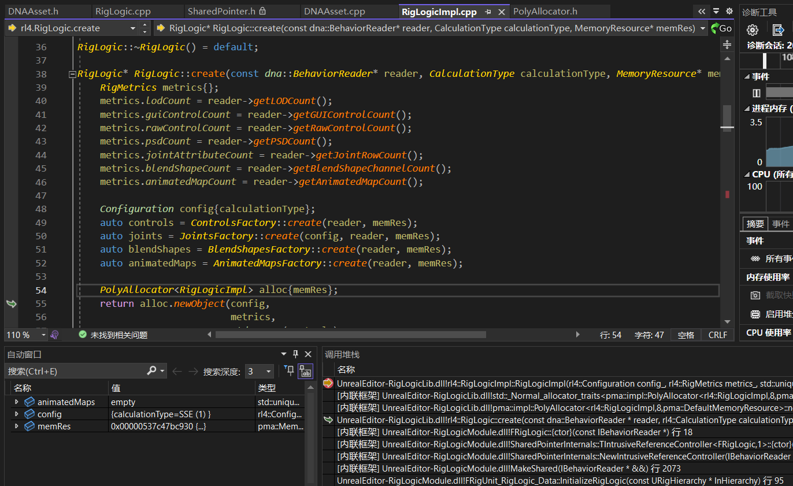

# 关于MetaHuman的表情逻辑驱动和骨骼捏脸

> 文章写下时的工作环境：UE5.0.3 

## 前言
去年在预研MetaHuman角色捏脸相关的技术，最近重温时发现很多都忘记了，想来还是要用文字记录下来。首先美术给到了MetaHumanCreator生成的角色资产，希望我们在其基础上对脸部的骨骼调整，达到捏脸的效果，同时还要保证原生的RigLogic表情系统能正常运作。我这边刚拿到USkeletalMesh资源后，发现在UE编辑器下对面部骨骼的transform进行操作却始终无法生效，于是找到了Epic官方发布的RigLogic白皮书，对其整个表情系统进行了学习，下面简单记录一下整个过程中遇到的技术要点

## MetaHuman表情逻辑入口
先说结论，MetaHuman面部表情的逻辑驱动入口在引擎层面上是靠一个ControlRig节点，打开MetaHuman的USkeletalMesh后，可以看到它自带了一个后处理动画蓝图(PostProcess ABP)，我们如果直接在窗口下方禁用它或者去除对它的引用，就能看到可以自由拖动面部骨骼了。其次在AssetUserData栏目下，可以看到一个UDNAAsset，如果在开启后处理动画蓝图的同时去除DNAAsset，会发现面部骨骼也能操作了。所以在引擎层面上，是后处理动画蓝图和DNAAsset两个一起配合驱动着RigLogi表情系统。所以如果要做骨骼捏脸方案，对面部骨骼进行修改，那么就应该遵循RigLogic原生的流程去处理。因此，我们就需要进一步探寻后处理动画蓝图的内容和DNAAsset之间的关联。


### 后处理动画蓝图
打开FaceProcessABP后，可以看到AnimGraph非常简单，只有一个ControlRig动画节点，如果不熟悉ControlRig工作原理的，可以看笔者的另一篇文章。打开动画节点引用的ControlRig资产，同样很简单只定义了一个ForwardsSolve事件，虽然连接出来的节点很多，但从整个执行流上看就两个部分：
1. 根据当前动画数据设置动画曲线数值
2. 执行RigLogic节点

而且RigHierarchy的骨骼树和MetaHuman的FReferenceSkeleton是一致的，所以在ControlRig里对任何骨骼的修改都会通过数据交换传递到外界。动画曲线只是浮点数集合，本身不包含任何逻辑计算，所以只需要将注意力集中到ControlRig图表中最后一个节点RigUnit_RigLogic

## RigUnit_RigLogic数据结构
在RigLogic节点里，有一个非常核心的数据结构FRigUnit_RigLogic_Data，它是整个RigLogic节点执行过程中的上下文，它包含了以下这两个关键的数据结构，了解它们是解读MetaHuman表情非常关键的一环。
- SharedRigRuntimeContxt
- RigInstance


### SharedRigRuntimeContxt
首先是SharedRigRuntimeContxt，RigUnit节点在初始化阶段会通过USkeletalMesh获取一个指向FSharedRigRuntimeContext的指针。MetaHuman白皮书说过DNAAsset是所有数据来源，它是一组二进制数据以AssetUserData的形式保存在USkeletalMesh中，我们在引擎里是无法直接解析数据类型。但是在UDNAsset的序列化流程里，在Loading阶段通过它们自己写的第三方库提供了解析DNA数据流的接口IBehaviorReader和IGeometryReader，并以此完成了SharedRigRuntimeContxt的接口初始化。

```C++
struct FSharedRigRuntimeContext
{
    //...
    	uint32 DNAHash;
	TSharedPtr<IBehaviorReader> BehaviorReader;
	TSharedPtr<IGeometryReader> GeometryReader;
	TSharedPtr<FRigLogic> RigLogic;

};
```

### FRigLogic
RigLogic是真正的数据容器，它存放了所有骨骼，控制器，BlendShapes等一系列数据。它的工厂构造函数通过初始化后的IBehaviorReader，将DNA里的原型数据读取出来并COPY单独出来，所以不同USkeletalMesh所对应的MetaHuman的数据都是相互隔离的，而一个USkeletalMesh对应的多个动画实例则共享同一份内存地址。



```C++
namespace rl4 {

class RigLogicImpl : public RigLogic {
    private:
        using ControlsPtr = std::unique_ptr<Controls, std::function<void (Controls*)> >;
        using JointsPtr = std::unique_ptr<Joints, std::function<void (Joints*)> >;
        using BlendShapesPtr = std::unique_ptr<BlendShapes, std::function<void (BlendShapes*)> >;
        using AnimatedMapsPtr = std::unique_ptr<AnimatedMaps, std::function<void (AnimatedMaps*)> >;

        // ... getter ...
        void calculateControls(RigInstance* instance) const override;
        void calculateJoints(RigInstance* instance) const override;
        void calculateJoints(RigInstance* instance, std::uint16_t jointGroupIndex) const override;
        void calculateBlendShapes(RigInstance* instance) const override;
        void calculateAnimatedMaps(RigInstance* instance) const override;
        void calculate(RigInstance* instance) const override;

        MemoryResource* getMemoryResource();
    private:
        MemoryResource* memRes;
        ControlsPtr controls;
        JointsPtr joints;
        BlendShapesPtr blendShapes;
        AnimatedMapsPtr animatedMaps;
        Configuration config;
        RigMetrics metrics;
};
}  // namespace rl4

```

## RigUnit_RigLogic执行流程
完成数据初始化后，在RigUnit_RigLogic在每帧的执行逻辑非常简单，一共就4步
1. Data.CalculateRigLogic(Hierarchy);
2. Data.UpdateJoints(Hierarchy, JointUpdateParamsTemp);
3. Data.UpdateBlendShapeCurves(Hierarchy, BlendShapeValues);
4. Data.UpdateAnimMapCurves(Hierarchy, AnimMapOutputs);

其中第3和第4步都是设置动画曲线数据，这里就先直接略过，关注第1步和第2步。

### CalculateRigLogic
从代码上看，这里在ControlRig资源里前半部分计算的RigHierarchy曲线数据，传递到RigInstance。我们注意到MetaHuman骨骼里有很多复杂名称的动画曲线，这些都是RigLogic算法库里预定义好的，曲线映射Mappings也是从DNA资源里获取的，每根曲线都对应某个特点表情特征，不要随意修改骨骼资产里的曲线定义。


将每根曲线数值转换为表情计算的输入RawControlInput并存在每个节点独有的RigInstance里，然后将其作为参数传递到RigLogicImpl里


然后依次计算Controls，Joints，BlendShapes，AnimatedMaps。其中Controls计算出来的数据会影响，后续3个计算的结果。

### UpdateJoints
根据表情输入设定计算出来的数据，接下来就是应用表情数据。一般是表情在骨骼上，都是以叠加的形式混合在基础骨骼上。RigLogic这里也是相同的处理，首先构造出一个骨骼数据，然后在UpdateJoints里将上一步计算出来的RigInstance->GetJointOutputs()作为DeltaTransform叠加到NeutralJoint里。

```C++
FRigUnit_RigLogic_JointUpdateParams JointUpdateParamsTemp
(
    Data.SharedRigRuntimeContext->RigLogic->GetNeutralJointValues(),
    Data.RigInstance->GetJointOutputs()
);
```


注意到NeutralJoint是从SharedRigRuntimeContext::RigLogic里获取的，这在同一个USkeletalMesh之间是共享的，它描述了一个MetaHuman的基础脸型。而DeltaTransform则是保存在RigInstance里，这在不同RigUnit里都是不同的，比如同一个Face根据不同动画曲线数值而呈现出不同的表情。

## 骨骼修改实现
未完待续